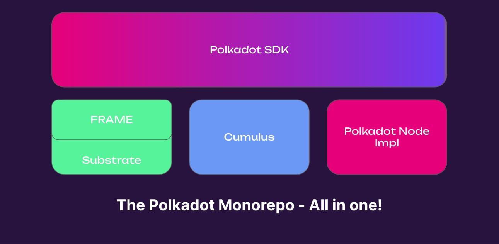
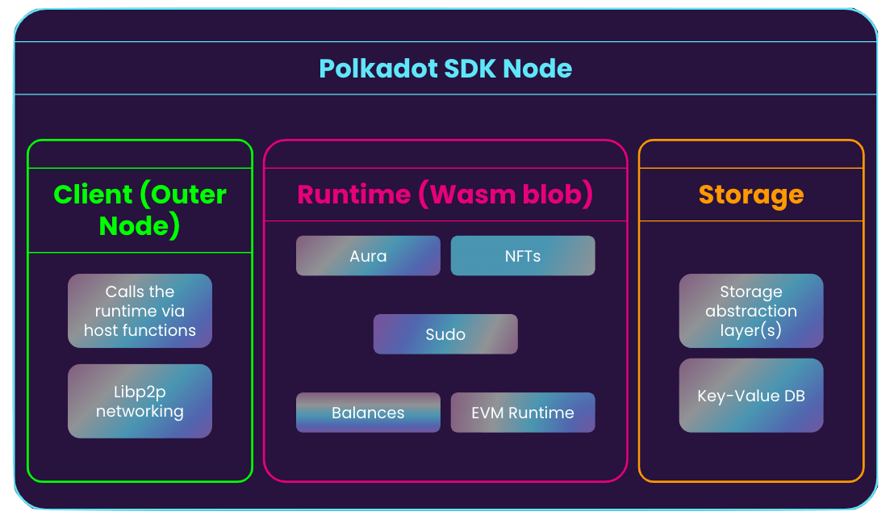
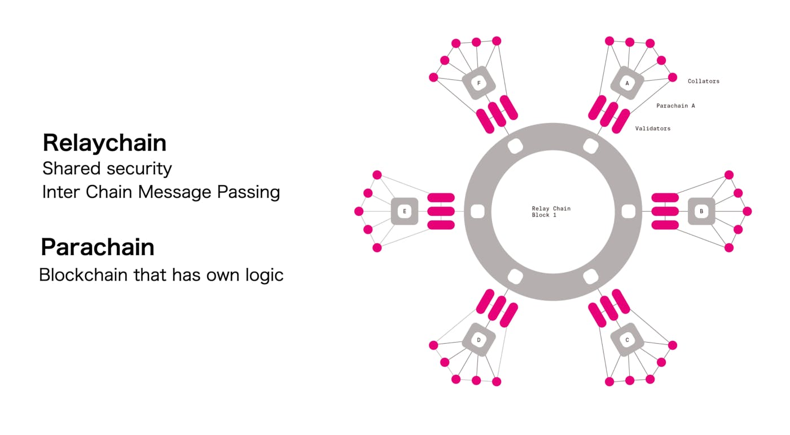
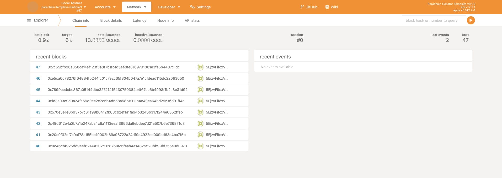

# Quickstart - Your First Chain

The Polkadot SDK should be on your radar to get into core blockchain development. The Polkadot SDK houses many tools that we can use to build blockchains, such as Substrate, a framework for building distributed protocols.  All crucial components to building your rollup, solo chain, or protocol are already included in Rust crates, including pre-made consensus protocols, block authoring, p2p networking, and more.

This article will primarily focus on getting you acquainted with the tools of the trade, spinning up your first local blockchain (appchain, rollup, or however you would like to phrase it), and practicing iterative development with the same setup.

An assumption is that you have installed Rust and its subsequent toolchain. If not, head to the [install page.](./install.md)

## A Primer on the Polkadot SDK and Cynical Rollups

At first glance, the Polkadot SDK can be rather overwhelming, and in a way it is - it packs a lot of tech into one place. The Polkadot SDK used to be overarching three repositories:

- [**Polkadot**](https://paritytech.github.io/polkadot-sdk/master/polkadot_sdk_docs/polkadot_sdk/index.html#polkadot) - Which for a time, included both the client implementation and runtime, until the runtime was moved to the [Polkadot Fellows](https://github.com/polkadot-fellows?ref=hackernoon.com) organization.
- [**Substrate**](https://paritytech.github.io/polkadot-sdk/master/polkadot_sdk_docs/polkadot_sdk/index.html#substrate) - The underlying, core primitives and libraries for building blockchains (any blockchain, not just one for Polkadot). Much of Polkadot is built with Substrate.
- [**Cumulus**](https://paritytech.github.io/polkadot-sdk/master/polkadot_sdk_docs/polkadot_sdk/index.html#cumulus) - A set of libraries and tools that pertain specifically to connecting blockchains to Polkadot, known as parachains.



You may notice the term “parachains“.  This is definitely a term you will come across in the Polkadot ecosystem, where a parachain is essentially a rollup that abides by the [ELVES (Efficient Execution Auditing for Blockchains under Byzantine Assumptions)](https://eprint.iacr.org/2024/961.pdf) protocol on Polkadot.  ELVES utilizes auditing committees (validator subsets) to ensure the state transitions of a given rollup is valid, and provides data availability, validity, security, and scalability into a single protocol

If you’re familiar with terms like “optimistic“ rollups, where everything is assumed as the best case, ELVES takes the opposite approach, where it has a more “cynical” approach to ensuring state transitions are valid.  For this reason, you may also see the term “pessimistic“, or “cynical“ rollups being used when referring to ELVES-abiding parachains.

## Installing pop-cli

I admit it - maybe we won’t be building from scratch, we’ll actually be using a template to kickstart our blockchain.

In order to avoid the hassle of handling binaries ourselves, we're going to use pop-cli.  pop-cli is a handy tool written in Rust that automatically pulls dependencies, compiles, and provisions entire networks for us.

Our main job when it comes to pop! is to be patient while we wait for things to compile - other than that, it's a breeze.

Head over to the GitHub repository, or install it via cargo:

```bash
cargo install --force --locked pop-cli
```

Once installed, you can make sure it's correctly working by running:

```bash
❯ pop --help
An all-in-one tool for Polkadot development.

Usage: pop <COMMAND>

Commands:
  new      Generate a new parachain, pallet or smart contract
  build    Build a parachain or smart contract
  call     Call a smart contract
  up       Deploy a parachain or smart contract
  test     Test a smart contract
  install  Set up the environment for development by installing required packages
  help     Print this message or the help of the given subcommand(s)

Options:
  -h, --help     Print help
  -V, --version  Print version

```

## Creating our First Blockchain

Now, it's time to create our chain.  Pop includes a number of different templates which allows us to have preconfigured blockchains with smart contracts, assets, or even an [entire EVM runtime](https://github.com/polkadot-evm/frontier?tab=readme-ov-file#polkadot-frontier) already ready to go.

When we generate our blockchain from a Pop! template, this will be its rough layout.



With pop installed, we can generate a blockchain by:

```bash
pop new parachain mychain
```

Once it's finished, you can follow the "Next Steps" as outlined:

```bash
cd into "mychain" and enjoy hacking! 🚀
# Build the parachain
pop build parachain
# Start a local relay chain and parachain network
pop up parachain -f ./network.toml
```

Keep in mind the "build" stage will take quite some time, depending on your machine.  Once it's finished building, you can then run:

```bash
❯ pop up parachain -f ./network.toml
┌   Pop CLI : Launch a local network
│
◇  🚀 Network launched successfully - ctrl-c to terminate
│  ⛓️ rococo-local
│       alice:
│         portal: https://polkadot.js.org/apps/?rpc=ws://127.0.0.1:52511#/explorer
│         logs: tail -f /var/folders/x0/hd8wpwmx2kgfqv8m03wxj2mw0000gn/T/zombie-e0a71b44-8ed0-4202-b10f-fbd030631587/alice/alice.log
│       bob:
│         portal: https://polkadot.js.org/apps/?rpc=ws://127.0.0.1:52515#/explorer
│         logs: tail -f /var/folders/x0/hd8wpwmx2kgfqv8m03wxj2mw0000gn/T/zombie-e0a71b44-8ed0-4202-b10f-fbd030631587/bob/bob.log
│  ⛓️ dev: 1000
│       collator01:
│         portal: https://polkadot.js.org/apps/?rpc=ws://127.0.0.1:8833#/explorer
│         logs: tail -f /var/folders/x0/hd8wpwmx2kgfqv8m03wxj2mw0000gn/T/zombie-e0a71b44-8ed0-4202-b10f-fbd030631587/collator01/collator01.log
│       collator02:
│         portal: https://polkadot.js.org/apps/?rpc=ws://127.0.0.1:8822#/explorer
│         logs: tail -f /var/folders/x0/hd8wpwmx2kgfqv8m03wxj2mw0000gn/T/zombie-e0a71b44-8ed0-4202-b10f-fbd030631587/collator02/collator02.log
```
Notice how this sets up:

- A local Rococo (a Polkadot testnet) relay chain with alice and bob validators respectively.

- Our custom blockchain - already configured with the relay chain with two collators, `collator01` and `collator02` respectively.

That’s right - we have a blockchain which is capable of hosting and coordinating other blockchains, called a **relay chain**, on our machine.  The topology is essentially this (but with one parachain instead of the eight in the figure below), but running locally on our machine - a fully sharded blockchain right on our laptop!


*Image Credit: https://www.elliptic.co/blockchain-basics/an-overview-of-the-polkadot-blockchain*

---

This setup is quite powerful, as with a single command, we have a multi-chain setup right on our machine. In theory, we could add more parachains which could talk to each other here, or other existing system parachains (like AssetHub) for further testing.

Go ahead and visit the link under collator01, which should look something like this (the port may be different):

```bash
https://polkadot.js.org/apps/?rpc=ws://127.0.0.1:8833#/explorer
```

It might take a minute, but you should see blocks being created and added to your network.  Feel free to also visit the relay chain Polkadot JS URL of either Alice or Bob.



## Iterative Development - Adding A Pallet

That's all well, but not terribly exciting - we want to add our own functionality to our blockchain.  While this isn't an exhaustive guide on Substrate pallet development, we can add a really basic pallet to our runtime, re-compile, and re-run pop to see it in real time.

A pallet is how we add custom functionality to our blockchain:

> [A pallet is a unit of encapsulated logic. It has a clearly defined responsibility and can be linked to other pallets.](https://paritytech.github.io/polkadot-sdk/master/polkadot_sdk_docs/polkadot_sdk/frame_runtime/index.html?#pallets)

Pallets are like the “Lego“ bricks of Substrate-based chains, which can be anything from consensus to application-specific business logic.  If we wanted to add WebAssembly smart contracts to our chain, for example, that would be in the form of a “pallet“.

First, go ahead and use pop to create a new pallet in the root of our directory:

```bash
pop new pallet
```

You should now have `pallets/pallet-template`, which already has some boilerplate code, which we can take a look at in lib.rs:

```rust
/// Configure the pallet by specifying the parameters and types on which it depends.
#[pallet::config]
pub trait Config: frame_system::Config {
	/// Because this pallet emits events, it depends on the runtime's definition of an event.
	type RuntimeEvent: From<Event<Self>> + IsType<<Self as frame_system::Config>::RuntimeEvent>;

}

#[pallet::pallet]
pub struct Pallet<T>(_);

// The pallet's runtime storage items.
// https://docs.substrate.io/build/runtime-storage/
#[pallet::storage]
#[pallet::getter(fn something)]
pub type Something<T> = StorageValue<_, u32>;

// Pallets use events to inform users when important changes are made.
// https://docs.substrate.io/build/events-and-errors/
#[pallet::event]
#[pallet::generate_deposit(pub(super) fn deposit_event)]
pub enum Event<T: Config> {
	/// Event documentation should end with an array that provides descriptive names for event
	/// parameters. [something, who]
	SomethingStored(u32, T::AccountId),
}

// Errors inform users that something went wrong.
#[pallet::error]
pub enum Error<T> {
	/// Error names should be descriptive.
	NoneValue,
	/// Errors should have helpful documentation associated with them.
	StorageOverflow,
}

// .. Other pallet stuff ..

/// An example dispatchable that takes a singles value as a parameter, writes the value to
/// storage and emits an event. This function must be dispatched by a signed extrinsic.
#[pallet::call_index(0)]
#[pallet::weight(Weight::from_parts(10_000, 0) + T::DbWeight::get().writes(1))]
pub fn do_something(origin: OriginFor<T>, something: u32) -> DispatchResultWithPostInfo {
	// Check that the extrinsic was signed and get the signer.
	// This function will return an error if the extrinsic is not signed.
	// https://docs.substrate.io/build/origins/
	let who = ensure_signed(origin)?;
	// Update storage.
	<Something<T>>::put(something);
	// Emit an event.
	Self::deposit_event(Event::SomethingStored(something, who));
	// Return a successful DispatchResultWithPostInfo
	Ok(().into())
}
```

This pallet's functionality is pretty simple:

We have a storage item called `Something`, which stores a `u32` value.  This gets stored as part of our blockchain’s state.  There are a few different storage items in Substrate which allows us to store state we want to persist to the network.

An event called `SomethingStored`, which gets triggered every time someone calls the `do_something` extrinsic.

An `Error`, which is used in the `cause_error` function.

In short, this pallet lets us store a number, update it, and emits an event every time that it is changed.  This number gets changed through a transaction on the blockchain, which is represented by the function `do_something`.  As mentioned previously, a pallet is merely a Rust crate, so we need to ensure it is added as such.

To fully add this pallet to our runtime, we need to:

1. Add the pallet as part of our workspace
2. The top level and runtime `Cargo.toml` respectively `runtime/src/lib.rs`

First, head to `pallets/pallet-template/Cargo.toml`, and replace the following dependency versions with `workspace = true` (you can just copy this for ease).  For reference, it’s essentially from `# Substrate` to the end of `dev-dependencies`:

```toml
# Substrate
frame-benchmarking = { workspace = true, default-features = false, optional = true}
frame-support = { workspace = true, default-features = false}
frame-system = { workspace = true, default-features = false}

[dev-dependencies]
sp-core = { workspace = true, default-features = false }
sp-io = { workspace = true, default-features = false}
sp-runtime = { workspace = true, default-features = false}
```


Next, go to the root level (the template) Cargo.toml in the template and add the following line:

```toml
pallet_template = { path = "./pallets/pallet-template", default-features = false }
```

Then, to the runtime's Cargo.toml, and add the following under [dependencies]:

```toml
pallet_template.workspace = true
```

After that, add scroll down to `std = [...]` and add the following:

```toml
std = [
	# ... other crates
	"pallet_template/std",
	# ... other crates
]
```

Head to `runtime/src/configs/mod.rs`, and add pallet_template to the runtime:

Import the pallet at the top of `mod.rs`:

```rust
/// Import the template pallet.
pub use pallet_template;
```

Next, we need to configure the pallet.  Add this with the other configurations (for example, under pallet_timestamp's configuration):

```rust
/// Configure the pallet-template in pallets/template.
impl pallet_template::Config for Runtime {
	type RuntimeEvent = RuntimeEvent;
}
```

Finally, navigate to runtime/src/lib.rs add pallet_template to the `construct_runtime!` macro.  This should go under the "XCM helpers" section, with an ID (in this case, 43) more than the last pallet ID:

```rust
// Create the runtime by composing the FRAME pallets that were previously
// configured.
construct_runtime!(
pub enum Runtime {
		// Other pallets here...
		// Our pallets
		Template: pallet_template = 43
	}
);
```

Once this is done, go ahead and run the following to rebuild your chain:

```bash
pop build parachain
# Run the network
pop up parachain --file ./network.toml
```

You should see the "template" pallet as part of your runtime.  You can check this by going back to PolkadotJS (under collator01 or collator02) , Under Developer > Chain State, then selecting the template pallet under the drop-down, where you should see the initial state of None if you click the + button on the right:

Congrats, you successfully added new functionality to your runtime!

## Concluding Thoughts & Where to Go Next

Let’s recap what we accomplished:

- We learned what the Polkadot SDK actually does (builds blockchains)
- We created a rollup/parachain using the pop-cli
- We spun up a local relay chain and parachain setup
- We added new functionality to our blockchain’s runtime, and re-launched it (iterative development)

You can now go on to continue [building your chain with whatever usecase](./build-chains/intro.md) you like - or, delve into the world of a more "traditional" web3 experience with [smart contracts](./build-contracts/intro.md) and [dApps](./build-dapps/intro.md).

